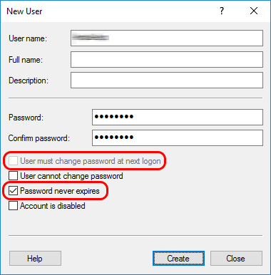

# Configuring Amplia to run with a local user

If you intend to use either the current user or local machine [Key stores](key-stores/index.md), it is highly recommended
that you configure Amplia to run with a local user account, instead of the default application pool identity.

Since the default app pool identity is not a full-fledged user account, it can be difficult to perform certain operations
that may be necessary when using the operating system's key stores:

* Run a program with the application pool identity
* Add the application pool identity to a local user group

To configure Amplia to run as a local user:

1. Create a local user account
   1. Open the *Computer Management* tool
   1. Under *System Tools*, expand the item *Local Users and Groups*, then right-click on *Users* and select **New User...**
   1. Enter a username (e.g.: `AmpliaApp`) and a password
   1. Uncheck the box **User must change password at next logon**
   1. Check the box **Password never expires**

      

   1. Click *Create*
1. Configure the application pool
   1. Open the *Internet Information Services (IIS) Manager*
   1. Expand the local server item, then click on *Application Pools*
   1. Click on the application pool corresponding to Amplia's site
   1. On the right menu, click on *Advanced Settings...*
   1. On the item **Identity**, click the button with **"..."**
   <!-- TODO: add image -->
   1. Click on **Custom account**, then **Set...**
   <!-- TODO: add image -->
   1. Type in the username and password chosen previously
   <!-- TODO: add image -->
   1. Click *OK*

## See also

* [Installing Amplia on Windows Server](install.md)
* [Key Store configuration](key-stores/index.md)
* [Troubleshooting](troubleshoot/index.md)
