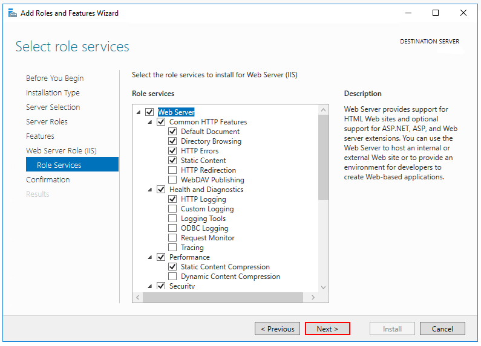

# Installing GrantID on Windows Server

> [!NOTE]
> The documentation for this system is currently under construction. We apologize for any inconvenience this may cause. Please
> contact us if there's any information you need that is not currently documented.


## IIS Setup

1. Open Server Manager and select the "Add Roles and Features" option:

1. In the Server Roles section, select Web Server (IIS):

1. In the Role Services section, select the desired services or accept the default options:

1. Open Internet Information Services (IIS) Manager and remove the Default Web Site:


## .NET Core Setup

1. Download and install the <a href="https://www.microsoft.com/en-us/download/details.aspx?id=48145" target="_blank">Microsoft Visual C++ 2015 Redistributable package</a>
1. Download and install the <a href="https://dotnet.microsoft.com/download/dotnet-core/thank-you/runtime-aspnetcore-2.1.16-windows-hosting-bundle-installer" target="_blank">NET Core 2.1 Hosting Bundle</a>
1. Download and install the <a href="https://go.microsoft.com/fwlink/?linkid=839516" target="_blank">Windows Management Framework (WMF) 5.1</a>

> [!WARNING]
> After the installation is complete, the server must be restarted.


## Installation Package Overview

An installation package named `grantid-<version_number>.zip` will be made available whenever you need to install/update GrantID.

GrantID is composed by 3 components:

1. **IdentityService**: REST service that must have access to a SQL Server Database.
1. **AuthServer**: OAuth 2.0 and OpenID Connect autorization server.
1. **Console**: console interface to setup applications.

The components may be installed in different servers or in the same, according to your needs, once the following requirements are met:

* The AuthServer must have network access to the IdentityService.
* The Console must have network access to the IdentityService. It does not need explicit network access to the AuthServer, but it may redirect an user to it, as all logins/registrations are handled by the AuthServer.
* The IdentityService must be updated before the other two components, since they rely on it's APIs.

Package folder structure:

* **Tools**: contains binaries that may be used to generate certificates and keys. **Requires <a href="https://www.microsoft.com/download/details.aspx?id=42642" target="_blank">NET Framework 4.5.2</a> to run**.
* **Keys**: contains the development certificate and key.
* **Config**: contains the configuration files used to set up the components.
* **Components**: contains the binaries of all the components.

## Installation Package Setup

* Create a working directory, for example: `C:\GrantId-Install`
* Unzip the installation package into a subfolder with the same name as the package (in the working directory).
* When installing to a production environment for the first time, it is strongly advised to replace the key and certificate found in the Keys directory of the unzipped installation package.


### Generating Certificate and Key files

* The `GrantID.pfx` certificate will be used to sign application tokens issued by GrantID. To generate a new certificate navigate to the Tools Folder using Powershell as administrator and execute the command:

```ps
grantid.exe gencert <certificate_name>
```

   Example:

```ps
grantid.exe gencert "GrantID Company X"
```

Move the generated file to the Keys folder. The file is generated with the same name as the one already present in the Keys folder so it will be overwritten.

* The `key.xml` is used to protect cookies and secrets generated by GrantID. Use the same utility used in the certificate generation steps with a different argument:

```ps
grantid.exe genkey [output_directory]
```

   Example:

```ps
grantid.exe genkey “C:\Keys”
```

Move the generated file to the Keys folder. The file is generated with the same name as the one already present in the Keys folder so it will be overwritten.