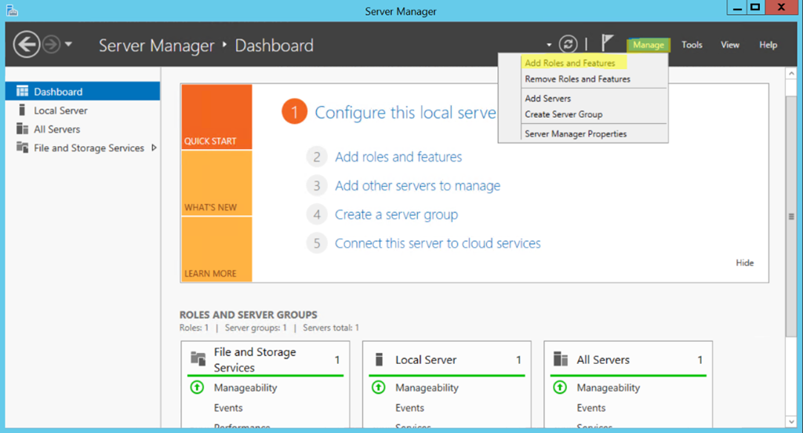
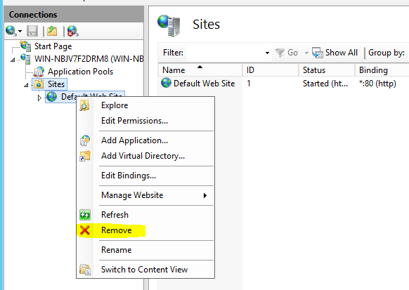

# Installing GrantID on Windows Server

> [!NOTE]
> The documentation for this system is currently under construction. We apologize for any inconvenience this may cause. Please
> contact us if there's any information you need that is not currently documented.

## IIS Setup

1. Open Server Manager and select the "Add Roles and Features" option:

1. In the Server Roles section, select Web Server (IIS):

1. In the Role Services section, select the desired services or accept the default options:

1. Open Internet Information Services (IIS) Manager and remove the Default Web Site:

## .NET Core Setup

1. Download and install the <a href="https://www.microsoft.com/en-us/download/details.aspx?id=48145" target="_blank">Microsoft Visual C++ 2015 Redistributable package</a>
1. Download and install the <a href="https://dotnet.microsoft.com/download/dotnet-core/thank-you/runtime-aspnetcore-2.1.16-windows-hosting-bundle-installer" target="_blank">NET Core 2.1 Hosting Bundle</a>
1. Download and install the <a href="https://go.microsoft.com/fwlink/?linkid=839516" target="_blank">Windows Management Framework (WMF) 5.1</a>

> [!WARNING]
> After the installation is complete, the server must be restarted.

## Installation Package Overview

An installation package named `grantid-<version_number>.zip` will be made available whenever you need to install/update GrantID.

GrantID is composed by 3 components:

1. IdentityService: REST service that must have access the a Database.
1. AuthServer: OAuth 2.0 and OpenID Connect autorization server.
1. Console: console interface to setup applications.

The components may be installed in different servers or in the same, according to your needs once the following requirements are met:

* The AuthServer must have network access to the IdentityService.
* The Console must have network access to the IdentityService. It does not need explicit network access to the AuthServer, but it may redirect an user to it, as all logins/registrations are handled by the AuthServer.
* The IdentityService must be updated before the other two components, since they rely on it's APIs.

## Installation Package Setup

1. Create a working directory, for example: `C:\GrantId-Install`
1. Unzip the installation package into a subfolder with the same name as the package (in the working directory).