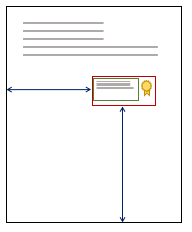

A visual representation of a PDF signature is the text or image with information about the document's internal signature. Some PDF visualization programs can link visual representations with the signature and signer data and properties. 

**Each visual representation is always related to only one PDF signature. And each PDF signature can have up to one visual representation.**

The sections below show the PDF signatures' visual representation options, parameters, and customizations.

## Visual Representation Elements

The visual representation dictionary has three parameters to be defined: position, text, and image. The list below briefly explains those visual representation elements.

* Position

  The visual representation rectangle can be automatic or manual positioned.

  * Automatic positioning

    We recommend the usage of automatic positioning when it's possible to delimit a region (container) of the PDF page for the insertion of visual representations. This positioning mode inserts and organizes the visual representation within the specified region. The figure below shows the behavior of the automatic positioning. The visual representations are inserted one by one inside the external container, illustrated by the red rectangle.

    

  * Manual positioning

    We recommend the usage of manual positioning when the position of each visual representation, or its regions, is not predefined, as when the user chooses the page and visual representation's position.

    

* Text

  The visual representations have textual information that is configured by the parameter `text`.

* Image

  The visual representations can have background images with customizable opacity and alignment. The parameter `image` configures these options.

## Visual representation positioning

Inside the parameter `position`, you can define the PDF page for the representation insertion, the position inside the page, and the measurement unit used to inform the position.

The parameter `pageNumber` sets the page to insert the visual representations. Negative numbers start counting from the end of the document, so -1 is the last page, -2 is the penultimate page, and so on. The special value 0 (zero) means a new blank page, at the end of the document, is used to insert the visual representations.

The parameter `measurementUnits` sets the measurement unit used to set the positioning parameters. The default unit is `"centimeters"` but `"pdfPoints"` is also a valid value. 

### Manual Positioning

The parameter `manual` sets the signature rectangle position on the page. The rectangle has the parameters  `top`, `bottom`, `left`, `right`, `width`, and `height`, as shown in the figure below. 

The code below exemplifies how to configure a visual representation to be inserted on the last page of the document; having 7cm of width and 3cm of height; with left and bottom margin of 2.5cm, as shown in the figure below. 

