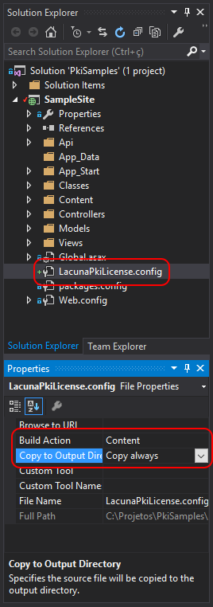

# Licensing

To enable the use of Lacuna PKI SDK you need to load the license at application startup. License may be used in formats

* File LacunaPKILicense.config
* String Base64

If you do not already have a license, please contact pki.lacunasoftware.com for a free trial license.

There are 3 ways to upload the license. The most recommended way depends on whether your application is a web or desktop application:

* For web applications, the most recommended method is to place the [LacunaPKILicense.config file in the DLL directory](#side-loaded-file)
* For desktop applications, the most recommended method is to set the license [Programmatically](#programmatically)

<a name="side-loaded-file" />
## LacunaPKILicense.config file in the DLL directory

The SDK automatically fetches the license .config file from its DLL (Lacuna.Pki.dll). Therefore, it is sufficient that the LacunaPKILicense.config file is copied during compilation to the same location as the DLL.


A practical way to do this is to include the `LacunaPKILicense.config` file in your site or application project and specify the **Build Action** file as **Content** and set **Copy to Output Directory** option to **Copy Always**.



This form is the most recommended for web applications.

## File .config

Another option is to include in the `Web.config` or `App.config` file of your site or application a tag with the path to the license .config file or a Base64 license tag, as shown below:

```xml
<appSettings>
  <!-- LacunaPKILicense.config file path -->
  <add key="LacunaPKI.LicensePath" value="[LacunaPKILicense.config file path]"/>

  <!-- or -->

  <!-- Base64 License -->
  <add key="LacunaPKI.BinaryLicense" value="[Base64 license]"/>
</appSettings>
```

<a name="programmatically" />
## Programmatically

The license can be loaded programmatically by calling the method @Lacuna.Pki.PkiConfig.LoadLicense(System.Byte[]) passing the decoded license value in Base64, preferably in the boot code of your site or application:

```csharp
// Licença em Base64
byte[] binLicense = Convert.FromBase64String("[given Base64 License]");

// Carregando Licença
PkiConfig.LoadLicense(binLicense);

// Uso habilitado
```

**This form is most recommended for desktop applications**, as the license is embedded in the source code of the application, making it difficult for third parties to leak.

It is also possible to use the method @Lacuna.Pki.PkiConfig.LoadLicense(System.String) to pass the path to the license .config file. However, this method **is not recommended for desktop applications** as it does not have the advantage of "hiding" the license.

```csharp
// Caminho para o arquivo LacunaPKILicense.config
string licensePath = "...";

// Carregando licença
PkiConfig.LoadLicense(licensePath);

// Uso habilitado
```

## Next steps

Having added the Lacuna PKI SDK package to your project and configured its license to use it, here's how to use the SDK by accessing the next topics like [Certificates](../certificates/index.md) e [Signatures](../signatures/index.md).

## See too

* Class @Lacuna.Pki.PkiConfig