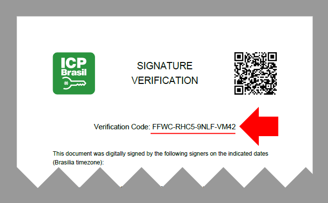

# Generating alphanumeric codes on .NET

When generating a printer-friendly version of a signed file, a "document verification code" needs to be included in the
document so that a third party receiving the printed document can access your website and provide the code to get back the
digitally signed version:



In the past, we provided the source code to generate this verification code as part of the samples, for instance:

```cs
public static class Util {
   
   // ...

   public static string GenerateVerificationCode() {
      // String with exactly 32 letters and numbers to be used on the codes.
      const string Alphabet = "ABCDEFGHJKLMNPQRSTUVWXYZ23456789";
      // Allocate a byte array large enough to receive the necessary entropy
      var bytes = new byte[(int)Math.Ceiling(VerificationCodeSize * 5 / 8.0)];
      // ...
      return sb.ToString();
   }

   // ...

}
```

However, since the verification code plays an important role in protecting the access to your documents, we now offer
the `AlphaCode` class on the *Lacuna.RestPki.Client* package to perform the code generation.

<a name="update-code" />
## Updating your app to use *AlphaCode*

> [!WARNING]
> The verification code generation has recently undergone a careful audit and has received important improvements.
> We highly recommend that you update your application to use *AlphaCode* instead of the old provided code.

You probably brought the (now obsolete) methods `GenerateVerificationCode`, `FormatVerificationCode` and `ParseVerificationCode`
into your own code. To update your application, simply replace the implementation with calls to methods of the *AlphaCode* class:

```cs
public static string GenerateVerificationCode() => AlphaCode.Generate();

public static string FormatVerificationCode(string code) => AlphaCode.Format(code);

public static string ParseVerificationCode(string formattedCode) => AlphaCode.Parse(code);
```

## Design principles

The class *AlphaCode* generates alphanumeric codes that are easy for humans to read, such that:

1. Codes should be easy to read
1. Codes should be easy to type back with low risk of mistaking similar characters such as `O` and `0`
1. Codes should have a relatively high entropy for the size of the code (high number of possible codes relative to the size of the code, allowing the developer
   to choose a relatively small code size).

To improve readability, the codes contain only uppercase letters and do not include characters like `O`, `0`, `1` and `I`, while
still maintaining a relatively high entropy per character. There are 32 possible characters, so every character adds 5 bits to the overall
entropy (25% better than using hexadecimal) which results in smaller codes for the same intended entropy.

For instance, to generate a code with 80 bits of entropy (2^80 possible codes):

* A hexadecimal code would need 20 characters, e.g.: `90A0-F20F-5883-8D55-AD31`
* An *AlphaCode* code would only need 16 characters, e.g.: `FFWC-RHC5-9NLF-VM42`

## See also

* [Using Rest PKI on .NET](index.md)
