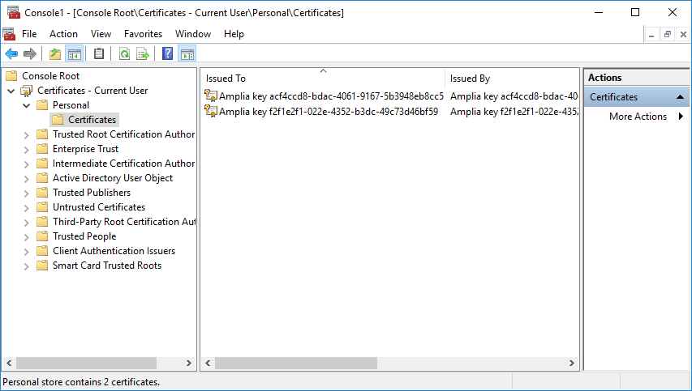

# Armazenamento de chaves no store nativo

> [!NOTE]
> Armazenamento de chaves no store nativo são compatíveis somente com instalações Windows Server e Linux. No Azure App Services, use [Armazenamento de chaves em Azure Key Vault](azure.md).

As chaves podem ser armazenadas no **armazenamento de chaves no store nativo** do sistema operacional, que é na verdade um conceito abstrato com significados diferentes, dependendo da
plataforma em que o Amplia está sendo executado.

Nesta abstração, dois armazenamentos de chave são definidos:

* O **repositório de usuários** é um armazenamento de chaves dedicado ao usuário do aplicativo e não requer que o aplicativo tenha privilégios administrativos.
* O **repositório da máquina** é um armazenamento de chaves compartilhado entre todos os aplicativos em execução na mesma máquina e requer privilégios administrativos para serem
acessados.

> [!TIP]
> Como o uso do armazenamento da máquina exige a elevação do usuário do aplicativo, geralmente é preferível usar o **armazenamento do usuário**.

Armazenamento de chaves no store nativo têm as seguintes vantagens:

* Chaves são armazenadas sem nenhum custo adicional
* É possível fazer o backup das chaves (a menos que você opte por gerar chaves não exportáveis)

No entanto, elas também possuem desvantagens:

* Como as chaves geralmente são armazenadas em arquivos no sistema de arquivos do servidor, pode ser difícil restringir o acesso à elas.
* Como cada servidor da Web possui seus próprios armazenamentos nativos, as implantações com vários servidores da Web (para *failover* ou balanceamento de carga) não podem usar
armazenamentos nativos.

Veja as seções a seguir para entender o atual significado do armazenamento de chaves no store nativo em cada uma das plataformas suportadas, como fazer o backup de chaves e como configurar o
Amplia para usar o armazenamento de chaves no store nativo. 

## Armazenamento de chaves no store nativo no Windows Server

No Windows Server, as chaves armazenadas em armazenamentos de chaves nativas são, na verdade, mantidas como certificados auto-assinados com uma chave privada associada nos armazenamentos de
certificados *Pessoais* do usuário atual ou da máquina local (também chamado de armazenamento *My*).



> [!WARNING]
> Para usar os armazenamentos de chave nativos no Windows Server, você deve [Amplia - Configuração para usar um usuário local](../windows/configure-app-user.md), caso contrário, você
não poderá fazer backup das chaves geradas.

Para fazer backup de armazenamentos de chaves no repositório de usuários:

1. No *Windows Explorer*, navegue até a pasta *C:\Windows\System32* e localize o executável **mmc.exe**
1. **Mantenha a tecla SHIFT e clique com o botão direito no arquivo**, então clique em **Run as different user**
1. Digite o nome de usuário e senha da conta local criada para o Amplia (veja aviso acima)
1. Clique em *File* e então **Add/Remove Snap-in...*
1. Selecione **Certificates** *snap-in* e clique em *Add*
1. Escolha a opção **My user account**, então *Finish* e *OK* no diálogo anterior
1. Expanda o item *Certifcates - Current User*, e a pasta **Personal**
1. Clique na pasta *Certificates*
1. Com o botão direito clique no certificado correspondente a chave que você quer fazer o backup, selecione *All Tasls*, então **Export...**
1. Escolha **Yes, export the key**
1. Deixe o padrão das opções para o próximo passo (*Export File Format*)
1. Digite uma senha forte para proteger o arquivo .PFX
1. Digite a localização para o arquivo .PFX

Para usar o *armazenamento de chaves da máquina* no Windows Server, depois você [Amplia - Configuração para usar um usuário local](../windows/configure-app-user.md)
você deve [Amplia - Configuração para usar um usuário local *Administradores* de grupo](../windows/configure-app-user.md).

Para backup do armazenamento de chaves no armazenamento de máquinas, repita o processo acima mas, no **passo 6**, escolha **Computer account**.

## Armazenamento de chaves no store nativo no Linux

No Linux,  as chaves armazenadas em armazenamentos de chaves nativas são armazenadas como arquivo PFX contendo uma assinatura de certificado com uma chave correspondente, armazenada no
diretótio */var/amplia/.dotnet/corefx/cryptography/x509stores/my*.

> [!NOTE]
> Armazenamento de chaves no store nativo da máquina não é suportado no Linux.

Os arquivos PFX não possuem senha, então as chaves são essencialmente armazenadas em texto simples. Assim sendo, é essencial a restrição de acesso ao diretório. Isto é porque, durante a
instalação, um `sudo chmod -R a=,g=rX,u=rwX /var/amplia` é realizado, removendo todo acesso de "outros" (exceto de membros do grupo *amplia* e usuários sudo).

> [!TIP]
> Para uma chave de proteção adicional no Linux, considere usando um HSM ou Azure Key Vault.

Para fazer backup das chaves,o backup do diretório mencionado acima (necessário sudo)

## Configurando Amplia para usar armazenamento de chaves no store nativo

Ao contrário dos outros armazenamentos de chaves, você não precisa adicionar entradas à seção configuração **KeyStores**. Em vez disso, eles podem ser ativados na seção **Amplia** no arquivo
de configuração:

* `NativeUserKeyStoreEnabled`: defina esta configuração para `true` para ativar o armazenamento de chaves no store nativo, chamado *NativeUser*
* `NativeMachineKeyStoreEnabled`: defina esta configuração para `true`para ativar armazenamento de máquinas no store nativo, chamado *NativeMachine* (não disponível no Linux)

Você pode usar os nomes dos armazenamentos mencionados acima para configurar o `DefaultKeyStore`. Por exemplo:

```json
	...,
	"Amplia": {
		...,
		"NativeUserKeyStoreEnabled": true,
		"DefaultKeyStore": "NativeUser",
		...
	},
	...
```

## Gerando chaves não exportáveis

Se você quiser gerar chaves não exportáveis em um armazenamento de chaves no store nativo, em vez de usar o método de configuração simplificado mencionado acima, você deve adicionar uma entrada à seção de configuração do **KeyStores**, como qualquer uma das ilustradas abaixo:

```json
	...,
	"KeyStores": {
		...,

		"NativeUser": {
			"Type": "Native",
			"ExportableKeys": true
		},

		...,

		"NativeMachine": {
			"Type": "Native",
			"UseMachineStore": true,
			"ExportableKeys": true
		},

		...
	},
	...
```

> [!WARNING]
> Chaves não exportáveis no armazenamento de store nativos não podem ser submetidas a backup!

## Veja também

* [Amplia - Armazenamento de chaves](index.md)
* [Amplia - Armazenamento de chaves do banco de dados](database.md)
* [Amplia - Armazenamento de chaves em CAPI](capi.md)
* [Amplia - Armazenamento de chaves em CNG](cng.md)
* [Amplia - Armazenamento de chaves em PKCS #11](pkcs11.md)
* [Amplia - Armazenamento de chaves em Azure Key Vault](azure.md)
* [Amplia on premises](../index.md)