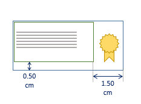

> [!NOTE]
> O container que definimos acima tem altura e largura variáveis. Essa é uma das muitas possibilidades de especificação do container de assinaturas. Para mais informações, veja o artigo [Definindo um container](containers.md).

As assinaturas realizadas com o código acima terão o resultado esperado conforme a imagem abaixo:

## Posicionamento de texto e imagem

* Texto

  Interno ao retângulo da representação visual da assinatura, o PKI Express permite a customização do alinhamento, posição e conteúdo do texto a ser inserido. O posicionamento do texto pode ser controlado através da definição de um `container`. Se nenhum container for definido, o texto preencherá todo o retângulo de assinatura.

  O alinhamento do texto dentro do container é customizável pelo parâmetro `horizontalAlign` (`left` ou `right`). O parâmetro `fontSize` permite customizar o tamanho da fonte utilizada no texto da representação.

  Para inserir a data e hora da assinatura é necessario colocar o parâmetro `includeSigningTime` como verdadeiro. E a formatação da data e hora da assinatura é customizável pelo parâmetro `signingTimeFormat`.

  O parâmetro `text` suporta o uso de *tags* que o PKI Express substitui pelas informações contidas no certificado. 
  * *Tags* genéricas:

    Tag               | Valor
    ----------------- | -----------
    `{{name}}`        | Valor mais apropriado para ser utilizado como nome do assinante (mais recomendado para esse propósito do que o `{{subject_cn}}`)
    `{{national_id}}` | Valor mais apropriado para ser utilizado como número de identidade nacional do assinante. Para certificados ICP-Brasil, corresponde ao CPF do assinante. Para certificados italianos, corresponde ao *codice fiscale* do assinante.
    `{{email}}`       | Endereço de email do assinante
    `{{subject_cn}}`  | O campo **Common Name** (CN) do titular (*subject name*) do certificado do signatário
    `{{issuer_cn}}`   | O campo **Common Name** (CN) do emissor (*issuer name*) do certificado do signatário

  * *Tags* específicas para certificados ICP-Brasil:

    Tag                     | Valor
    ----------------------- | -----------
    `{{br_cpf}}`            | CPF do titular (para certificados de PJ, CPF do responsável pelo certificado)
    `{{br_cpf_formatted}}`  | Mesmo que `{{br_cpf}}` porém formatado como **000.000.000-00**
    `{{br_cnpj}}`           | CNPJ da empresa
    `{{br_cnpj_formatted}}` | Mesmo que `{{br_cnpj}}` porém formatado como **00.000.000/0000-00**
    `{{br_responsavel}}`    | Nome do titular (para certificados de PJ, nome do responsável pelo certificado)
    `{{br_company}}`        | Nome da empresa
    `{{br_oab_numero}}`     | Número de Inscrição junto a Seccional da OAB (sem zeros à esquerda)
    `{{br_oab_uf}}`         | Sigla do Estado da Seccional da OAB
    `{{br_rg_numero}}`      | Número do RG do titular/responsável (sem zeros à esquerda)
    `{{br_rg_emissor}}`     | Órgão emissor do RG do titular/responsável
    `{{br_rg_uf}}`          | UF do órgão emissor do RG do titular/responsável

  * *Tags* suportadas para manter a retrocompatibilidade:

    Tag                    | Tag equivalente
    ---------------------- | ---------------
    `{{signerName}}`       | `{{name}}`
    `{{signerEmail}}`      | `{{email}}`
    `{{signerNationalId}}` | `{{national_id}}`
    `{{issuerCommonName}}` | `{{issuer_cn}}`
    `{{br_oab_numbero}}`   | `{{br_oab_numero}}`

  Como exemplo, definiremos um posicionamento do texto relativo ao retângulo de assinatura conforme a figura abaixo.

  
