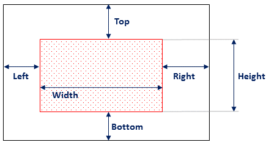
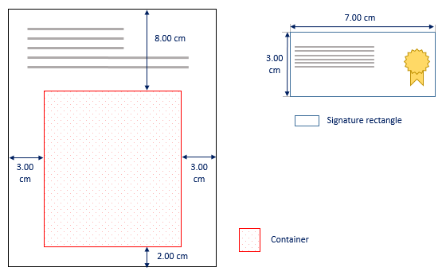

# Representação Visual

A representação visual na assinatura de PDF é a inclusão de um texto ou imagem contendo informações sobre a assinatura que está interna ao documento. Dependendo do software de visualização do PDF, esta representação pode fazer uma ligação com os dados e propriedades da assinatura e do signatário.

Esta representação possui uma relação biunívoca com a assinatura interna ao PDF, ou seja, **cada assinatura pode ter apenas uma representação visual e cada representação visual ser relativa a apenas uma assinatura no PDF**.

Nas seções abaixo exploraremos as opções, parâmetros e customizações na definição de uma representação visual para assinaturas em PDF.

## Elementos da Representação Visual

O array de representação visual possui 3 parâmetros que podem ser definidos: `position`, `text` e `image`. A lista abaixo introduz os elementos da representação visual.

* Posição

  A posição do retângulo da representação visual da assinatura pode ser definida de forma automática ou manual.

  * Posicionamento Automático

    O posicionamento automático é indicado para casos em que pode-se definir uma região (container) em uma página do PDF que irá receber a representação das assinaturas. Este modo irá organizar as assinaturas em série dentro da região especificada. A figura abaixo exemplifica o comportamento do posicionamento automático. O retângulo vermelho representa o container definido no qual as representações visuais serão posicionadas automaticamente em série.

    

  * Posicionamento Manual

    O posicionamento manual é indicado para os casos em que cada representação das assinaturas serão inseridas em posições arbitrárias, por exemplo a posição e a página serem informados pelo usuário.

    

* Texto

  As informações textuais a serem inseridas na representação visual da assinatura são customizáveis pelo parâmetro `text`.

* Imagem

  É possível incluir uma imagem de fundo na representação visual da assinatura, podendo também customizar sua opacidade e seu alinhamento dentro do retângulo da representação visual. Estas opções são definidas pelo parâmetro `image`.

## Posicionamento da representação da assinatura

No posicionamento, define-se a página na qual a representação da assinatura será inserida, sua a posição na página e a unidade de medida utilizada para informar a posição.

A página é especificada pelo parâmetro `pageNumber`. 
Números negativos são contados a partir do final do documento (-1 significa última página, -2 penúltima, etc).
Pode-se usar o valor especial 0 (zero), que especifica que a representação da assinatura deve ser colocada em uma nova página em branco adicionada ao final do documento.

A unidade de medida é especificada pelo parâmetro `measurementUnits`. Por padrão o seu valor é `'centimeters'`, mas também pode ser `'pdfPoints'`.

### Posicionamento Manual

A posição do retângulo de assinatura em relação à página é especificada pelo parâmetro `manual`. Um retângulo pode ter os parâmetros `top`, `bottom`, `left`, `right`, `width` e `height` conforme mostrado na figura abaixo.



Por exemplo, para especificar que a representação visual deve ser inserida na última página do documento, tendo tamanho
7cm de largura e 3cm de altura, ficando a 2.5cm das margens esquerda e inferior, conforme a imagem abaixo, escreveríamos
o seguinte código:


```javascript
const signer = new PadesSigner();
...
visual = {
  position: {
    pageNumber: -1,     // Define inserção na última página do documento
    manual: {
      width: 7,         // Largura = 7cm
      height: 3,        // Altura = 3cm
      left: 2.50,       // Distância da margem esquerda = 2.50cm
      bottom: 2.50      // Distância da margem inferior = 2.50cm
    }
  },
  text: {...},
  image: {...}
};
signer.setVisualRepresentation(visual);
```

Para mais informações sobre como definir a posição da representação da assinatura, veja o artigo
[Definindo um container](containers.md).

### Posicionamento Automático

No posicionamento automático, ao invés de se definir o posicionamento da representação visual em relação à página, define-se um
container que irá receber as representações das sucessivas assinaturas realizadas no documento e o tamanho de cada
retângulo de assinatura dentro do container.

O container de assinaturas é definido pelo parâmetro `container`. 
De maneira similar à especificação do retângulo de assinatura no posicionamento manual, o container pode ter os parâmetros
`top`, `bottom`, `left`, `right`, `width` e `height`.
Já o tamanho de cada retângulo de assintura (`width` e `height`) é definido pelo parâmetro `signatureRectangleSize`.

A propriedade `rowSpacing` define o espaçamento entre as "linhas" das representações visuais. 
Quando não há mais espaço em uma linha, as representações são inseridas em uma nova linha respeitando o `rowSpacing` passado.

Por padrão, as assinaturas são inseridas da esquerda para direita, de cima para baixo. No entanto, esse comportamento pode ser customizado com os parâmetros `horizontalDirection` (`'rightToLeft'` ou `'leftToRight'`) e `verticalDirection` (`'topDown'` ou `'bottomUp'`).

Por exemplo, para especificar que as representações visuais devem ser inseridas sucessivamente na última página do documento dentro de um container espaçado 2.5cm das bordas esquerda, direita e inferior e 10cm da borda superior, sendo que cada retângulo de assinatura deve ter 7cm de largura por 3cm de altura, conforme ilustrado na imagem abaixo, escreveríamos o seguinte código:



```javascript
const signer = new PadesSigner();
...
visual = {
  position: {
    pageNumber: -1,               // Define inserção na última página do documento
    auto: {
      container: {
        left: 3.00,               // Distância da margem esquerda = 3.00cm
        right: 3.00,              // Distância da margem direita = 3.00cm
        bottom: 2.00,             // Distância da margem inferior = 2.00cm
        top: 8.00                 // Distância da margem superior = 8.00cm
      },
      signatureRectangleSize: {
        height: 3,                // Altura = 3cm
        width: 7                  // Largura = 7cm
      },
      rowSpacing: 1.00            // 1.00cm de espaçamento entre linhas
    }
  },
  text: {...},
  image: {...}
};
signer.setVisualRepresentation(visual);
```

> [!NOTE]
> O container que definimos acima tem altura e largura variáveis. Essa é uma das muitas possibilidades de especificação do container de assinaturas. Para mais informações, veja o artigo [Definindo um container](containers.md).

As assinaturas realizadas com o código acima terão o resultado esperado conforme a imagem abaixo:


## Posicionamento de texto e imagem

* Texto

  Interno ao retângulo da representação visual da assinatura, o PKI Express permite a customização do alinhamento, posição e conteúdo do texto a ser inserido. O posicionamento do texto pode ser controlado através da definição de um `container`. Se nenhum container for definido, o texto preencherá todo o retângulo de assinatura.

  O alinhamento do texto dentro do container é customizável pelo parâmetro `HorizontalAlign` (`left` ou `right`). O parâmetro `fontSize` permite customizar o tamanho da fonte utilizada no texto da representação.

  Para inserir a data e hora da assinatura é necessario colocar o parâmetro `includeSigningTime` como verdadeiro. E a formatação da data e hora da assinatura é customizável pelo parâmetro `signingTimeFormat`.

  Como exemplo, definiremos um posicionamneto do texto relativo ao retângulo de assinatura conforme a figura abaixo.

  

```javascript
visual = {
  text: {                                       // Texto da representação visual
    text: 'Signed by {{name}}',                 // Inclui o nome do signatário
    container: array  (                         // Define container do texto
      left: 0,
      top: 0,
      right: 1.5,
      bottom: 0.5
    },
    includeSigningTime: true,                   // Inclui a data da assinatura
    signingTimeFormat: 'dd/MM/yy H:mm:ss zzz',  // Define a formatação da data
    fontSize: 10.0                              // Define tamanho da fonte do texto
  },
  position: {...},
  image: {...}
};
```

* Imagem

  Também é possível definir uma imagem de fundo para o retângulo de assinatura e customizar sua opacidade e alinhamento.

  Como exemplo, definiremos um posicionamneto do texto relativo ao retângulo de assinatura conforme a figura abaixo.
```javascript
const signer = new PadesSigner();
...
signer.addFileReference('stamp', "imagem_de_fundo.png");
visual = {
  text: {...},
  position: {...},
  image: {
    resource: {
      url: 'fref://stamp',    // Utiliza imagem_de_fundo referenciada como  'stamp'
    },
    horizontalAlign: 'Right', // Alinha a imagem horizontamente na direita
    verticalAlign: 'Center',  // Alinha a imagem verticalmente no centro
  },
};
signer.setVisualRepresentation(visual);
```
## Veja também

* [Exemplos completos de representação visual](samples.md)