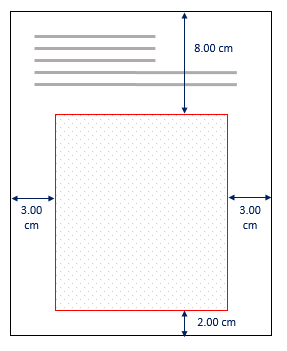
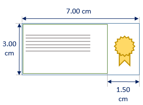
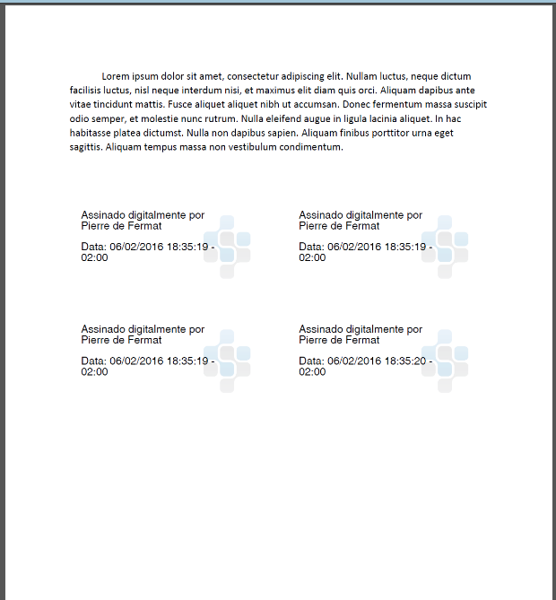

# Exemplos completos

## Exemplo completo com posicionamento automático

Criaremos um posicionamento automático customizado que será aplicado na última página do documento.

O container de inclusão, região na qual as representações visuais das assinaturas serão organizadas automaticamente,
será definido seguindo o modelo representado na imagem abaixo.



O código abaixo exemplifica como definir estes parâmetros em um container.

```ruby
container = PkiExpress::PadesVisualRectangle.new
container.left = 3.0
container.right = 3.0
container.bottom = 2.0
container.top = 8.0
```

Para mais informações de como definir um Container, veja o artigo [Definindo um container](containers.md)

Cada assinatura incluída terá sua representação visual seguindo os parâmetros do retângulo de assinatura, texto e imagem
seguindo o modelo representado pela imagem abaixo.



O retângulo externo da assinatura tera 3cm x 7cm. Será incluído um brasão de imagem de fundo alinhada à direita no
retângulo de assinatura. O container do texto terá uma margem direita de 1.50cm em relação ao retângulo externo,
impedindo, para este exemplo, que o texto fique por cima da imagem. O código abaixo demonstra como definir estes parâmetros.

```ruby
# Definindo retângulo de assinatura
signature_rectangle = PkiExpress::PadesVisualRectangle.new
signature_rectangle.width = 7
signature_rectangle.height = 3

# Define container do texto
container = PkiExpress::PadesVisualRectangle.new
container.left = 0.0
container.top = 0.0
container.right = 1.5
container.bottom = 0.0

# Definindo imagem de fundo
image = PkiExpress::PadesVisualImage.new
# Bytes da imagem a ser inserida
image.content = pdf_content 
# Alinha a imagem horizontamente na direita
image.horizontal_align = PadesHorizontalAlign::RIGHT
# Alinha a imagem verticalmente no centro
image.vertical_align =PadesVerticalAlign::CENTER
```

À medida que as assinaturas forem sendo realizadas, o resultado esperado para as representações visuais incluídas
automaticamente é o apresentado na imagem abaixo.


## Exemplo completo com posicionamento automático

```ruby
signer = PkiExpress::PadesSigner.new
signer.pkcs12 = cert
signer.cert_password = 'password'
signer.pdf_to_sign = pdf_content_bytes
signer.signature_policy = PkiExpress::StandardSignaturePolicies::PADES_BASIC_WITH_LTV

vr = PkiExpress::PadesVisualRepresentation.new
# Define posicionamento automático
position = PkiExpress::PadesVisualAutoPositioning.new
position.page_number = -1
# Define o espaçamento entre linhas de representações visuais
position.row_spacing = 1.0
# Define o retângulo da representação visual
size = PkiExpress::PadesSize.new(7.0, 3.0)
position.signature_rectangle_size = size
# Define o container para posicionamento das representações visuais
position_container = PkiExpress::PadesVisualRectangle.new
position_container.left = 3.0
position_container.right = 3.0
position_container.bottom = 2.0
position_container.top = 8.0
position.container = position_container
vr.position = position

# Texto da representação visual
# Define o texto a ser inserido. Para ver a lista completa de tags suportadas, veja: 
# https://docs.lacunasoftware.com/articles/pki-express/ruby/visual-rep/index.html#pades-tags
text = PkiExpress::PadesVisualText.new('Signed by {{name}}')
# Define tamanho da fonte do texto.
text.font_size = 13.0
# Define que o horário da assinatura também seja renderizado.
text.include_signing_time = true
# Define a formatação da data.
text.signing_time_format = "dd/MM/yy H:mm:ss zzz"
# Opicional. Define o container retangular dentro 
# da representação da assinatura onde o texto será
# inserido. Por padrão, o texto pode ocupar todo o
# retângulo da representação (o quanto será de 
# fato preenchido depende do comprimento do texto
# e do tamanho da fonte).
container = PkiExpress::PadesVisualRectangle.new
container.left = 0.0
container.top = 0.0
container.right = 1.5
container.bottom = 0.5
text.container = container
vr.text = text

image = PkiExpress::PadesVisualImage.new
image.content = pdf_content
# Define imagem alinhada à direita no retângulo da representação visual.
image.horizontal_align = PadesHorizontalAlign::RIGHT
# Define imagem centralizada verticalmente no retângulo da representação visual.
image.vertical_align =PadesVerticalAlign::CENTER
vr.image = image

# Define representação visual na assinatura
signer.visual_representation = vr

signer.output_file_path = output_file_path

# Assina o documento e insere a representação visual
signer.sign
```

A execução do exemplo acima produz o seguinte resultado na assinatura de um PDF:

