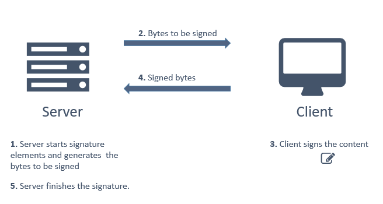

# Assinaturas web remotas

Uma *assinatura remota* é uma [assinatura digital](../signatures.md) realizada com uma chave privada que não está disponível localmente,
ou seja, em que o algoritmo de assinatura em si precisa ser computado remotamente. Como a realização do algoritmo pode depender de
diversos fatores como latência de rede e intervenção do usuário, o processo de realizar assinaturas remotamente é inerentemente
assíncrono, significando que o processo se inicia, espera-se a realização remota do algoritmo e só então finaliza-se o processo.

Chamamos de *assinaturas web remotas* o caso especial de assinaturas remotas em que o processo de assinatura está sendo realizado numa
aplicação web com o backend controlando o processo, porém utilizando um certificado do usuário, cuja chave privada está disponível
somente no lado do cliente.

Na maioria dos casos **esta é a forma recomendada de implementar assinaturas web com nossos produtos** (veja o artigo
[assinaturas web](index.md) para exceções).

Esse processo, em linhas gerais, ocorre da seguinte maneira:

1. O backend inicia a assinatura, gerando os bytes que precisam ser utilizados como entrada do algoritmo de assinatura utilizando
   a chave privada do usuário (chamados de "to-sign-data")
1. O "to-sign-data" é transmitido para o lado do cliente
1. O algoritmo de assinatura é realizado no frontend com a chave privada do certificado do usuário
1. O resultado do algoritmo de assinatura é transmitido de volta ao servidor
1. O backend finaliza o processo de assinatura

> [!NOTE]
> Isso é apenas uma visão geral. Existem passos adicionais, como ler a codificação binária do certificado no frontend e enviar
> ao backend.

**A forma recomendada de implementar assinaturas web remotas é utilizando o [Rest PKI](../../rest-pki/index.md)** em conjunto com
o [Web PKI](../../web-pki/index.md).

## Passo-a-passo

1. Acesse a [documentação do Rest PKI](../../rest-pki/index.md)
1. Escolha uma linguagem de programação
1. Escolha um dos projetos de exemplos disponíveis
1. Siga os passos para executar o projeto
1. Uma vez executando o projeto, clique em algum dos exemplos de assinatura

> [!TIP]
> Embora a solução envolva o Rest PKI em conjunto com o Web PKI (para as operações no backend e frontend respectivamente),
> **concentre-se na documentação do Rest PKI** que já mostra o uso dos dois produtos integrados.

## Implementações alternativas

Se a sua aplicação web for em .NET (C#, VB.NET, C++.NET), você pode também utilizar o [PKI SDK](../../pki-sdk/index.md) no backend
em conjunto com o Web PKI no frontend. Para mais informações, veja o artigo
[Assinaturas web remotas](../../pki-sdk/signatures/web-remote.md) na documentação do SDK.

Se você já possui uma biblioteca de terceiros para certificação digital ou deseja implementar o código do backend você mesmo,
você pode também utilizar o [Web PKI](../../web-pki/index.md) apenas para realizar as operações necessárias no frontend.
