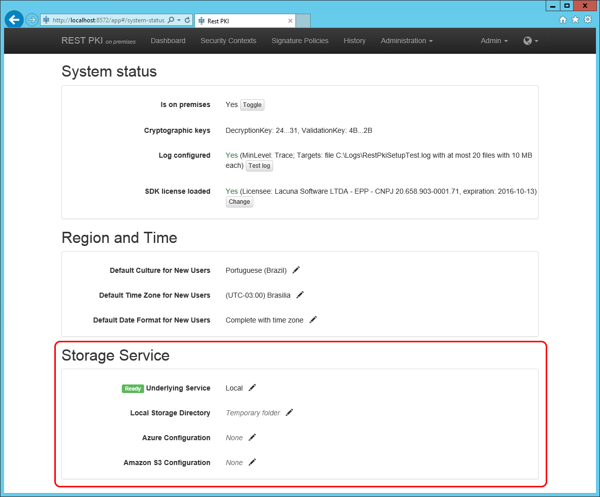

# Configuração de Storage - Rest PKI

Para manter o banco de dados organizado, o [Rest PKI](../index.md) armazena arquivos temporários fora do banco de dados.
Os arquivos podem ser armazenados em *serviços* diferentes:

* Local (sistema de arquivos)
* [Azure Storage](https://azure.microsoft.com/en-us/services/storage/)
* [Amazon S3](https://aws.amazon.com/s3)

Por padrão, as instâncias [*on premises*](index.md) vêm configuradas para armazenar arquivos na pasta temporária
do servidor web. Entretanto, pode ser necessário alterar essa configuração, especialmente caso você queira executar
o Rest PKI em múltiplos servidores. Nesse caso, é necessário que as várias instâncias compartilhem o mesmo banco de
dados **e o mesmo storage**.

A configuração de storage é feita pela interface web do sistema:

1. Autentique-se com um usuário administrador
1. Vá em **Administração** &gt; **Status do Sistema**

Em seguida, configure a seção **Serviço de Armazenamento** conforme uma das seções abaixo.



## Local

Para armazenar os arquivos temporários no sistema de arquivos local, na opção **Serviço Base** escolha **Local**.

Em seguida, preencha a opção **Diretório do Armazenamento Local** com o caminho da pasta onde o Rest PKI deve armazenar os arquivos. Exemplo:

```
C:\AppData\RestPki
```

> [!NOTE]
> Em uma instalação multi-servidores, essa pasta deve ser compartilhada entre os servidores web

## Azure Storage

Para armazenar os arquivos temporários em um *container* do [Azure Storage](https://azure.microsoft.com/en-us/services/storage/),
na opção **Serviço Base** escolha **Azure Blob Storage**.

Em seguida, preencha a opção **Configuração do Azure** da seguinte maneira:

```
<account name>;<account key>;<container name>
```

Exemplo:

```
patorumstorage;MYSECRETKEY;restpkifiles
```

## Amazon S3

Para armazenar os arquivos temporários em um *bucket* do [Amazon S3](https://aws.amazon.com/s3),
na opção **Serviço Base** escolha **Amazon S3**.

Em seguida, preencha a opção **Configuração do Amazon S3** da seguinte maneira:

```
<access key>;<secret key>;<nome do bucket>
```

Exemplo:

```
MYACCESSKEY;MYSECRETKEY;restpkifiles
```
