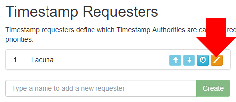
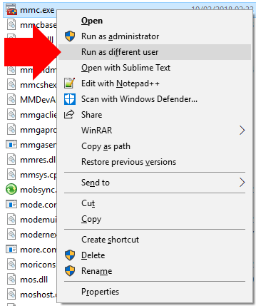

# Configuração de Carimbo de Tempo - Rest PKI

Para realizar assinaturas digitais na sua instância [*on premises*](index.md) do [Rest PKI](../index.md) utilizando
políticas de assinatura que requeiram carimbo de tempo de assinatura, por exemplo políticas **PAdES-T** ou
**CAdES Ad-RT**, é necessário contratar um serviço externo de provimento de carimbos de tempo.

> [!NOTE]
> Você pode utilizar o Rest PKI em nuvem (https://pki.rest/) para prover carimbos de tempo para a sua instância do Rest PKI.
> Veja os preços [aqui](https://www.lacunasoftware.com/pt/certificate/#/restPlans).

O serviço de provimento de carimbos de tempo deve atender aos seguintes requisitos:

* Comunicação via *Timestamp Protocol* (TSP - RFC 3161) sobre HTTP ou HTTPS
* Formas de autenticação suportadas:
  * HTTP basic authentication
  * SSL/TLS com autenticação mútua
  * OAuth Bearer Token

Caso opte por utilizar o Rest PKI cloud, siga os passos abaixo para obter as credenciais de acesso:

1. Autentique-se no site do Rest PKI cloud (https://pki.rest/)
1. No Painel de Controle, clique no botão **Gerar novo token de acesso**
1. Copie o valor gerado e guarde temporariamente em um bloco de notas

Caso opte por outro provedor de carimbos de tempo, solicite os dados de acesso ao provedor (URL e credenciais).

Uma vez tendo os dados de acesso ao provedor de carimbos de tempo, siga os passos abaixo para configurar a sua
instância do Rest PKI:

1. Acesse a sua instância do Rest PKI
1. Autentique-se com usuário "Admin" ou outro usuário administrador (a senha foi definida durante a instalação)
1. No menu superior, vá em **Administração** &gt; **Tipos de Carimbo de Tempo**
1. Clique no item *ICP-Brasil*

   

1. Na área **Carimbadoras de Tempo**, digite um nome e clique em **Criar**

   

1. Na tela seguinte, preencha a URL do provedor e clique em **Create**
   * No caso do Rest PKI cloud, a URL é: `https://pki.rest/tsp/a402df41-8559-47b2-a05c-be555bf66310`
1. Uma vez criada a carimbadora, entre nas configurações dela

   

1. No campo **Autenticação**, escolha a opção especificada pelo provedor
   * No caso do Rest PKI cloud, a opção deve ser **OAuth Bearer Token**
1. Dependendo da escolha feita, um novo campo será exibido e deve ser preenchido:
   1. *HTTP basic authentication*: preencha o campo **Credenciais** com o usuário e senha fornecidos pelo provedor
   1. *OAuth Berer Token*: preencha o campo **Token OAuth** com o valor do token fornecido pelo provedor (**sem** o prefixo "Bearer")
   1. SSL com autenticação mútua: veja a [seção abaixo](#ssl-mutual-auth)
1. Clique no botão **Testar**. Caso apareça a mensagem "O teste foi bem sucedido", a configuração está OK.

<a name="ssl-mutual-auth" />
## Autenticação via SSL/TLS com autenticação mútua

Para utilizar um provedor de carimbos de tempo que exija autenticação via SSL/TLS com autenticação mútua, você precisa
primeiro importar o certificado fornecido pelo provedor no repositório de certificados do Windows, na pasta Personal do
usuário que é utilizado para executar o Rest PKI.

De posse do arquivo .pfx (PKCS #12) fornecido pelo provedor, siga uma das seções abaixo dependendo do ambiente no qual o 
Rest PKI está instalado para importar o certificado para o repositório do Windows.

### Configuração em Windows Server

1. Acesse o servidor onde o Rest PKI está instalado
1. Crie um usuário local para o Rest PKI
   1. No menu iniciar, busque por "Edit local users and groups" e clique nele
   1. Clique com o botão direito na pasta Users e clique em **New User...**
   1. Preencha um nome do usuário e a senha
   1. Desmarque a opção *User must change password at next logon*
   1. Marque a opção *Password never expires*
   1. Clique em **Create**
1. Conceda as permissões necessárias ao novo usuário na pasta de instalação do Rest PKI
   1. Localize a pasta na qual o Rest PKI está instalado (ex: `c:\inetpub\RestPKI`)
   1. Clique com o botão direito na pasta e vá na aba **Security**
   1. Clique em **Edit...** &gt; **Add..** &gt; digite o nome do usuário criado e clique em **OK**
   1. Deixe marcados apenas os itens **List folder contents** e **Read**
   1. Clique em **OK**
1. Altere a identidade do *application pool*
   1. Abra o *IIS Manager*
   1. Vá nos *Application Pools*
   1. Clique no *application pool* do Rest PKI
   1. Clique em **Advanced Settings...** no menu da direita
   1. Na seção **Process Model**, edite a configuração **Identity**
   1. Escolha a opção **Custom account**
   1. Clique no botão **Set...** e entre com as credenciais escolhidas para o usuário criado
   1. Clique em **OK**
1. Verifique se o Rest PKI continua funcionando normalmente (acesse a interface web)
1. Navegue até a pasta `C:\Windows\System32`
1. Localize o arquivo `mmc.exe`
1. Pressione a tecla SHIFT e clique com o botão direito no arquivo
1. Clique na opção **Run as different user**

   

1. Entre com as credenciais do usuário criado
1. Vá em **File** &gt; **Add/Remove Snap-in...**
1. Clique em **Certificates**, clique no botão **Add &gt;** e clique em **OK**
1. Expanda a pasta **Certificates - Current User**
1. Clique com o botão direito na pasta **Personal** &gt; **All Tasks** &gt; **Import...**
1. Siga o *wizard* fornecendo o arquivo .pfx e a senha deste

Uma vez importado o certificado, ele será listado no campo **SSL Certificate** da configuração do provedor de carimbos de tempo do Rest PKI.

### Configuração em Azure App Service

1. Acesse as configurações do App Service no dashboard do Azure
1. Acesse os **SSL certificates** do App Service
1. Clique em **Upload Certificate**
1. Forneça o arquivo .pfx e a senha deste e clique em **Upload**
1. Após o término da operação, o certificado aparecerá na lista de certificados
1. Copie o valor da coluna **Thumbprint** do certificado
1. Acesse os **Application settings** do App Service
1. Na seção *Application settings*, adicione uma nova configuração
   * Nome: `WEBSITE_LOAD_CERTIFICATES`
   * Valor: (valor copiado da coluna *Thumbprint*)
1. Salve as configurações

Uma vez importado o certificado, ele será listado no campo **SSL Certificate** da configuração do provedor de carimbos de tempo do Rest PKI.
