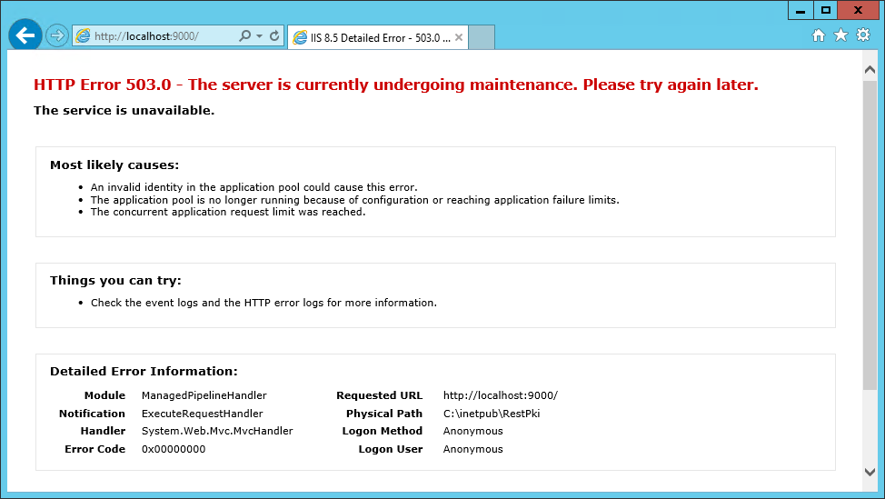
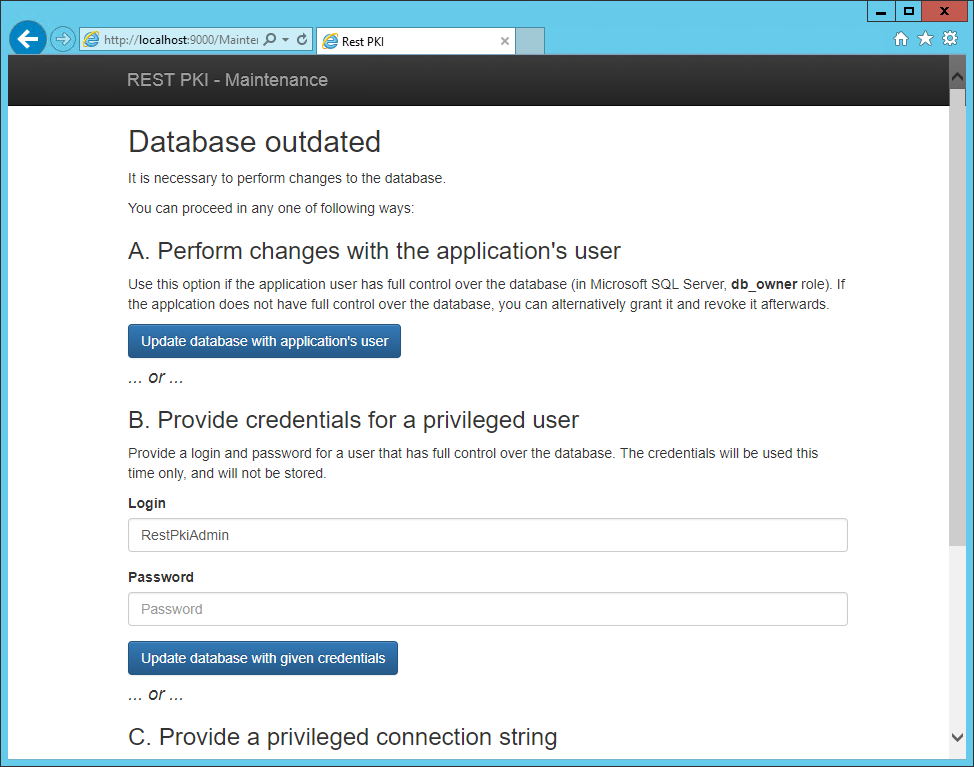

# Atualização do Rest PKI em Windows Server

Para atualizar a sua instância do [Rest PKI](../../index.md), siga os passos abaixo:

1. Tire um backup do banco de dados e da pasta do site
1. Extraia o conteúdo do novo pacote do Rest PKI ([restpki-1.17.1.zip](https://files.lacunasoftware.com/restpki/restpki-1.17.1.zip)) para a pasta do site, sobrescrevendo todos os arquivos
1. Acesse o site

> [!NOTE]
> Como o pacote não contém arquivos chamados AppSettings.config e Connections.config, os seus arquivos com esses nomes contendo as configurações do sistema serão preservados durante a operação.

Caso seja exibida a tela inicial com o título "REST PKI on premises", o processo estará concluído.

Entretanto, em alguns casos, pode ser exibida a mensagem "HTTP Error 503.0 - The server is currently undergoing maintenance. Please try again later.", conforme abaixo:

Nesse caso, siga as instruções da seção a seguir.

<a name="db-update" />
## Atualização do banco de dados

Caso ao atualizar o Rest PKI apareça a mensagem "HTTP Error 503.0 - The server is currently undergoing maintenance. Please try again later." mencionada na seção anterior, isso significa que é preciso atualizar o banco de dados.

> [!NOTE]
> Para saber com antecedência se uma atualização demandará atualização do banco de dados, observe no [Histórico de versões](../../changelog.md) se alguma das
> versões entre a versão que encontra-se instalada (veja [este artigo](../check-version.md) para saber como descobrir a versão instalada) e a que você está instalando está marcada como demandando atualização do banco de dados.

Nesse caso, acesse a URL `/Maintenance` relativa ao endereço do site (por exemplo, `http://localhost:9000/Maintenance`) e siga as instruções na tela.

> [!NOTE]
> Para acessar essa URL é preciso estar acessando o site localmente ou via HTTPS. Caso precise acessar essa URL remotamente via HTTP, veja a seção 2.4.5 do [Manual de instalação em Windows Server](https://files.lacunasoftware.com/restpki/restpki-admin-guide-pt.pdf)

Nesse passo, o sistema irá atualizar as tabelas no banco de dados. Utilize uma das opções exibidas na tela para efetuar as alterações, de acordo com a opção de permissões da aplicação sobre o banco de dados escolhida durante a instalação:

* Caso o sistema seja *owner* do banco de dados, prossiga com a opção **A** (*Perform changes with the application’s user*)
* Caso o sistema tenha apenas permissões de leitura e escrita no banco de dados, prossiga com a opção **B** (*Provide
  credentials for a privileged user*). Forneça então "RestPkiAdmin" como usuário privilegiado (ou o nome de usuário escolhido
  durante a instalação como usuário administrador do banco de dados) e a senha deste

Após seguir as instruções, a tela inicial com a mensagem "REST PKI on premises" será exibida e o procedimento de atualização estará concluído.

## Veja também

* [Resolução de problemas](troubleshoot/index.md)
