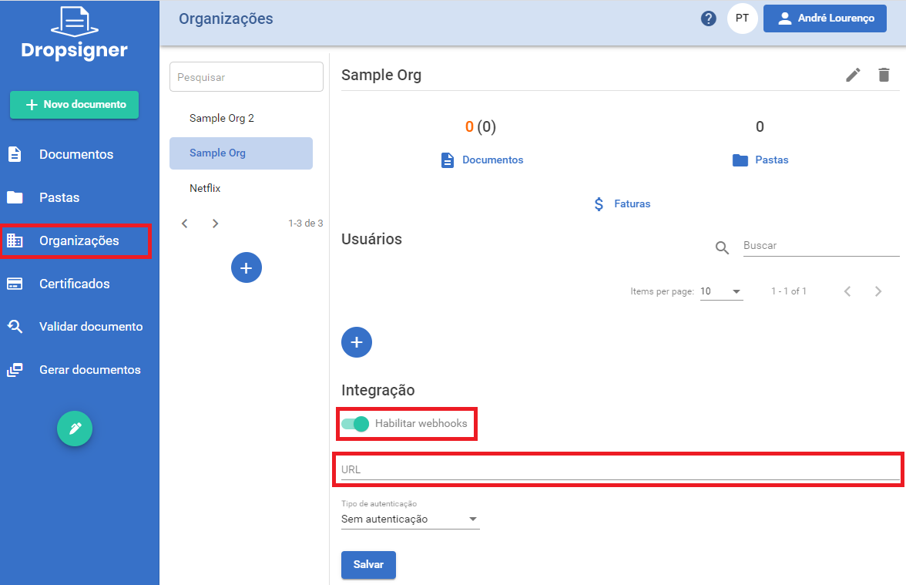

# Guia de Integração

## Introdução

O Signer é um portal de documentos que permite a realização de assinaturas digitais e eletrônicas bem como a criação de fluxos complexos. Este documento
discute as possíveis opções de integração para que sua aplicação possa aproveitar ao máximo o potencial do Signer.


## Autenticação

Todas as chamadas de API exigem uma chave de acesso de API (*API Key*). Essa chave deve ser colocada no cabeçalho de todas requisições:

```javascript
X-Api-Key: sua-aplicacao|xxxxxxxxxxxxxxxxxxxxxxxxxxxxxxxxxxxxxxxxxxxxxxxxxxxxxxxxxxxxxxxx
```

Toda chave de API está associada uma Organização previamente cadastrada no Signer. Sendo assim, o escopo dessa chave fica **restrito àquela organização**,
isto é, aquela chave só permitirá acessar/criar documentos daquela organização.

> [!NOTE]
> Para obter uma chave de API entre em contato com o administrador da sua instância.


## Opções de integração

Para começar escolha um dos itens abaixo:

* [Assinar um documento](#sign-document)

* [Verificar o status de um documento](#check-document)

* [Enviar lembretes de assinatura](#document-reminders)

* [Validar assinaturas de um documento](#validate-signatures)

<a name="sign-document" />
## Assinar um documento

Para assinar um documento siga o passo a passo abaixo:

1. Faça o upload do arquivo a ser assinado usando a [API de Upload (POST /api/uploads)](https://www.dropsigner.com/swagger/index.html#operations-Upload-post_api_uploads). 
Será retornado um ID de upload que identifica aquele arquivo.

	```javascript

	```

1. Crie um documento à partir do upload usando a [API de Criação de Documentos (POST /api/documents)](https://www.dropsigner.com/swagger/index.html#operations-Documents-post_api_documents). 
Nessa chamada você irá montar o fluxo do documento, isto é, definir quem deverá assinar o documento e em qual ordem.

> [!NOTE]
> Você pode criar mais de um documento na mesma chamada. A resposta irá retornar o ID do documento criado associado ao ID do upload, assim você
> sabe exatamente qual documento corresponde a cada upload.

Ao criar o documento, o Signer automaticamente notifica os signatários adicionados no fluxo seguindo a ordem especificada. Cada signatário receberá
um e-mail com um link que permitirá a assinatura do documento. Não é preciso se autenticar para assinar ou aprovar o documento.

Para mais detalhes sobre esse caso de uso, veja nossos exemplos no github:

* [C#](https://github.com/LacunaSoftware/SignerSamples/blob/master/dotnet/console/Console/Scenarios/CreateDocumentWithOneSignerScenario.cs)
* [Java](https://github.com/LacunaSoftware/SignerSamples/blob/master/java/console/src/main/java/com/lacunasoftware/signer/sample/scenarios/CreateDocumentWithOneSignerScenario.java)

### Assinatura em sua própria aplicação

Caso você queira realizar a assinatura do documento em sua própria aplicação, você pode usar a opção de **Assinatura Embutida**.

Para isso, você deve seguir os mesmos passos exibidos na seção anterior, no entanto, ao enviar o documento deve marcar a opção 
`disablePendingActionNotifications` como `true`. Dessa forma o Signer não vai enviar notificações para os assinantes.

Após a criação do documento, utilize o ID do documento para obter a URL de Assinatura usando a [API de URL de Ação](https://www.dropsigner.com/swagger/index.html#operations-Documents-post_api_documents__id__action_url).

Uma vez obtida a URL de assinatura, utilize o *Widget de assinatura* para renderizar a página de assinatura do Signer na sua aplicação.
A página [Assinatura embutida](embedded-signature.md) descreve como utilizar o *Widget*.

Para mais detalhes sobre esse caso de uso, veja nossos exemplos no github:

* [C#](https://github.com/LacunaSoftware/SignerSamples/blob/master/dotnet/console/Console/Scenarios/EmbeddedSignatureScenario.cs)
* [Java](https://github.com/LacunaSoftware/SignerSamples/blob/master/java/console/src/main/java/com/lacunasoftware/signer/sample/scenarios/EmbeddedSignatureScenario.java)


<a name="check-document" />
## Verificar o status de um documento

Para verificar o status de um documento é preciso conhecer o seu ID. Em seguida, basta fazer uma chamada à [API de Detalhes do Documento](https://www.dropsigner.com/swagger/index.html#operations-Documents-get_api_documents__id_):

```javascript

```

	* Para saber se o documento está concluído, verifique a propriedade `isConcluded`.
	* Para saber se um participante assinou/aprovou, verifique se a propriedade `status` corresponde a `Completed` do elemento da lista de 
	ações (`flowActions`) que corresponde a ele.

Adicionalmente, você pode configurar um Webhook que será disparado toda vez que um documento de uma organização for concluído. Para isso, basta 
acessar a tela da Organização e registrar a URL desejada na opção Integração:



Para mais detalhes sobre esse caso de uso, veja nossos exemplos no github:

* [C#](https://github.com/LacunaSoftware/SignerSamples/blob/master/dotnet/console/Console/Scenarios/CheckDocumentStatusScenario.cs)
* [Java](https://github.com/LacunaSoftware/SignerSamples/blob/master/java/console/src/main/java/com/lacunasoftware/signer/sample/scenarios/CheckDocumentStatusScenario.java)

<a name="document-reminders" />
## Enviar lembretes de assinatura

Uma vez verificado o status de um participante conforme mostrado no caso de uso de [Verificação de status](#check-document),
caso você queira enviar lembretes periódicos para participantes do fluxo que ainda não completaram uma ação, você pode usar a [API de Envio de Lembretes](https://www.dropsigner.com/swagger/index.html#operations-Documents-get_api_documents__id_)
informando o Id do documento e o ID do participante (`flowActionId`):

```javascript

```

Para mais detalhes sobre esse caso de uso, veja nossos exemplos no github:

* [C#](https://github.com/LacunaSoftware/SignerSamples/blob/master/dotnet/console/Console/Scenarios/NotifyFlowParticipantsScenario.cs)
* [Java](https://github.com/LacunaSoftware/SignerSamples/blob/master/java/console/src/main/java/com/lacunasoftware/signer/sample/scenarios/NotifyFlowParticipantsScenario.java)

<a name="validate-signatures" />
## Validar assinaturas de um documento

Você pode validar as assinaturas de um documento de duas formas: com chave de validação do documento (caso ele tenha sido assinado no signer) ou com o arquivo
assinado.

### Validação de documento com chave de validação

Para validar um documento com chave de validação, use a [API de Validação de Chave](https://www.dropsigner.com/swagger/index.html#operations-Documents-get_api_documents_keys__key__signatures) informando a chave correspondente.

```javascript

```

Serão retornados os dados básicos do documento e as informações de cada uma das assinaturas encontradas naquele documento.

### Validação de documento com arquivo assinado

Para validar um documento assinado é preciso fazer primeiro o upload do arquivo assinado usando a [API de Upload](https://www.dropsigner.com/swagger/index.html#operations-Upload-post_api_uploads).

```javascript

```

Em seguida, utilize a [API de validação de arquivo](https://www.dropsigner.com/swagger/index.html#operations-Documents-post_api_documents_validate_signatures).

Serão retornados os dados de cada uma das assinaturas encontradas no documento.
