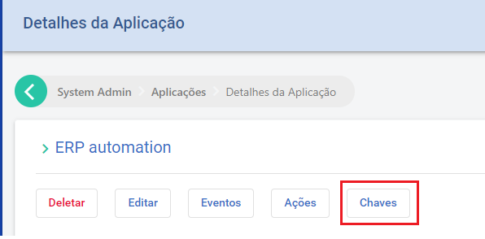
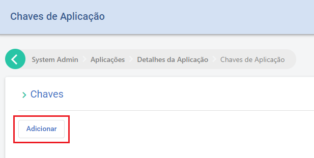
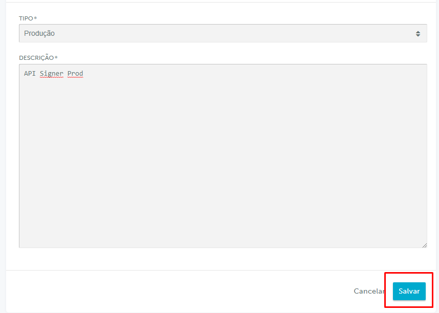
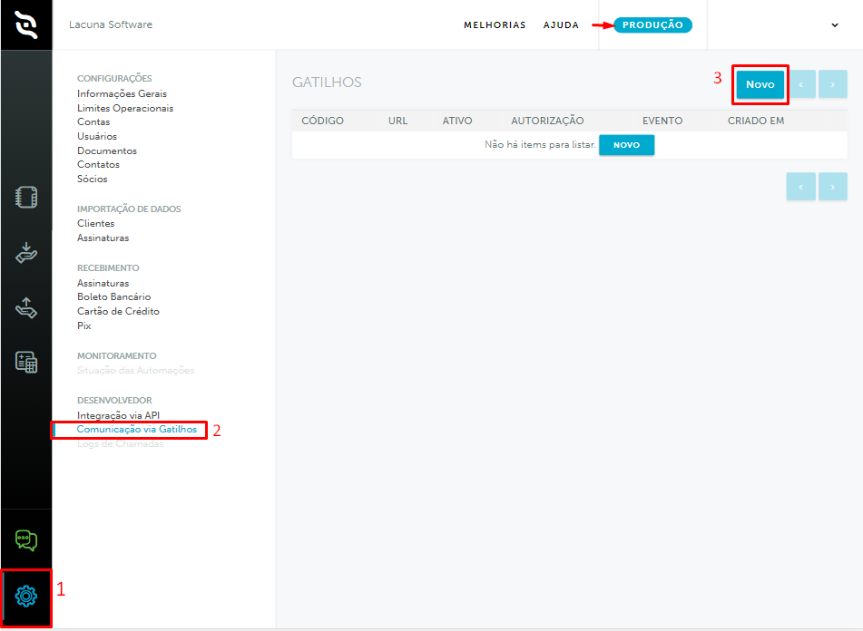
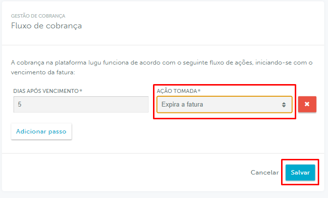
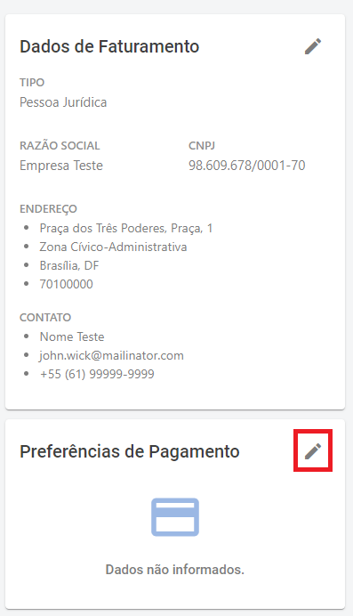
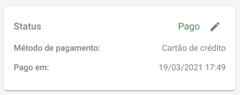
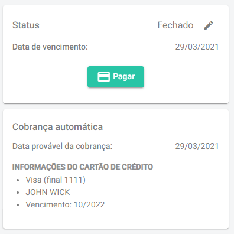

# Pagamentos no Signer

Esta página descreve as opções para obtenção de pagamentos relativos às faturas geradas pelo Sistema de Cobranças.

## Sistema de Cobranças

O Signer possui um Sistema de Cobranças flexível que permite ao administrador da instância escolher quais serviços 
serão tarifados: documento, assinatura, aprovação etc. Caso não esteja visualizando na sua instância as opções 
descritas aqui verifique se o módulo de cobrança foi habilitado.

O Sistema de Cobranças trabalha com a geração de faturas mensais sem data de duração, isto é, após a virada do mês
a fatura é fechada e fica disponível para consulta/pagamento de um usuário ou organização.

O administrador da instância pode escolher se o não pagamento das faturas irá bloquear ou não os usuários/organizações.

As opções disponíveis para processamento de pagamentos estão descritas abaixo:

### Operação Simplificada

Para instâncias com número pequeno de usuários/organizações, a gerência de pagamentos pode ser feita externalmente ao 
sistema.

Nesse modelo, fica a cargo do administrador da instância verificar as faturas fechadas, notificar o cliente responsável
e processar o pagamento de cada fatura.

Uma vez identificado que o pagamento foi realizado, a fatura pode ser consultada e seu status alterado na tela de 
detalhes da fatura pelo administrador:


### Operação via Integração

Para instâncias com um grande número de usuários/organizações, recomenda-se que a gerência de pagamentos seja feito de maneira
automatizada.

O primeiro passo para automatizar o processo é configurar o webhook de cobrança da instância. Isso deve ser feito em 
Administração > Cobrança > Integração:


Uma vez configurado o Webhook, o endereço especificado receberá uma requisição POST após o fechamento de cada fatura.

Segue abaixo um exemplo desta requisição:

<pre>
{
	"type": "InvoiceClosed",
	"data":
	{
		"id": 126,
		"month": 9,
		"year": 2020,
		"value": 5,
		"invoiceTotals": [
			{
				"transactionType": "Document",
				"price":
				{
					"transactionType": "Document",
					"pricingType": "Simple",
					"price": 0.5,
					"priceRanges": null
				},
				"total": 10,
				"value": 5
			},
			{
				"transactionType": "ElectronicSignature",
				"price":
				{
					"transactionType": "ElectronicSignature",
					"pricingType": "NoCharge",
					"price": null,
					"priceRanges": null
				},
				"total": 1,
				"value": 0
			},
			{
				"transactionType": "Signature",
				"price":
				{
					"transactionType": "Signature",
					"pricingType": "Range",
					"price": null,
					"priceRanges": [
						{
							"limit": 10,
							"price": 0
						},
						{
							"limit": 20,
							"price": 0.5
						},
						{
							"limit": null,
							"price": 0.25
						}
					]
				},
				"total": 8,
				"value": 0
			}
		],
		"organization":
		{
			"id": "6a49d03c-5f3f-428c-8221-8474366f98d0",
			"name": null,
			"identifier": null,
			"owner":
			{
				"id": "12c1d41a-77b2-404e-a155-84cc7d0f93e8",
				"name": null
			}
		},
		"billingInformation":
		{
			"type": "Individual",
			"individual":
			{
				"name": "Danilo Igor das Neves",
				"identifier": "57972418624"
			},
			"company": null,
			"contactName": "",
			"email": "daniloneves@mailinator.com",
			"phone": "+55 (84) 3619-9479",
			"streetAddress": "Rua Principal, s/n",
			"addressNumber": "696",
			"additionalAddressInfo": "Apto 110",
			"neighborhood": "Bom Descanso",
			"address": "",
			"address2": "",
			"zipCode": "59430972",
			"city": "Lagoa de Velhos",
			"state": "RN"
		}
	}
}
</pre>

Para a referência completa da requisição veja [o schema Webhooks.InvoiceClosedModel no Swagger](https://www.dropsigner.com/swagger/index.html#model-Webhooks.InvoiceClosedModel).

Para exemplos de código, veja os links abaixo:

* [C#](https://github.com/LacunaSoftware/SignerSamples/blob/master/dotnet/console/Console/Scenarios/InvoiceWebhookHandlingScenario.cs)

* [Java]() em construção.

> [!NOTE]
> O Webhook pode ser utilizado também na Operação Simplificada.

O sistema que receber o Webhook deve processar o evento da fatura e gerar a cobrança correspondente notificando o email especificado
nos dados de cobrança.

Ao detectar o pagamento da fatura, ele deve enviar uma requisição ao Signer para informar que a fatura foi paga, conforme definido
abaixo:

```javascript
PUT /api/invoices/{id}/payment

{
	"isPaid": true
}
```

Para exemplos de código, veja os links abaixo:

* [C#](https://github.com/LacunaSoftware/SignerSamples/blob/master/dotnet/console/Console/Scenarios/InvoiceWebhookHandlingScenario.cs)

* [Java]() em construção.

> [!WARNING]
> Para esta requisição será necessária uma chave de API com privilégios de administração de cobrança no sistema.

#### Criação de chave de API de administração de cobrança

Para gerá-la crie uma aplicação selecionado a organização Sys Admin: 


Em seguida gere a chave na opção "Chaves":






### Operação via Gateway de pagamentos iugu

Oferece meios de pagamentos automatizados diretamente no Signer com uma integração à [iugu](https://www.iugu.com/). Desta forma, depois que uma fatura é fechada os próprios usuários/organizações podem realizar o pagamento com cartão de crédito, boleto bancário ou Pix.

#### Integração do Signer com a iugu

A iugu possui [planos de assinatura](https://www.iugu.com/planos/) e cada plano traz funcionalidades, mudanças nas tarifas e custos por transação que devem ser avaliados pelo administrador da instância, mas o Signer é capaz de funcionar plenamente com o plano mais básico "Conheça a iugu".

Para que a integração entre a instância do Signer e a iugu possam ser feitas, são necessários algumas etapas. O primeiro passo é realizar o [cadastro na iugu](https://auth.iugu.com/new_user?service=https%3A%2F%2Falia.iugu.com%2F).

O próximo passo, após o cadastro, é acessar o [painel de controle](https://alia.iugu.com/) da iugu e gerar um API Token. Acesse as configurações, depois Integração via API e clicar no botão Novo.


Depois escolha o tipo "Produção" e escreva na descrição: "API Signer Prod".



Em seguida será preciso obter o ID da conta na iugu. Acesse as configurações, depois Informações gerais. Logo abaixo de "Conta" será exibido o ID da sua conta na iugu.


O próximo passo é configurar o Webhook para notificar o Signer sobre os pagamentos, também na tela de configurações, acesse "Comunicação via Gatilhos" e depois clique no botão Novo.



O campo url deve ser preenchido com o domínio ter a seguinte rota:

```
https://seu-signer.com.br/api/webhooks/iugu/invoice/changed
```

O campo autorização deve ser preenchido da seguinte forma:

```javascript
Bearer WebhooksAuthKey
```
`WebhooksAuthKey` deve ser substituído por uma chave de sua escolha, mas é recomendado a escolha de uma combinação de caracteres de pelo menos 10 dígitos.

> [!WARNING]
> O webhook deve ser gerado no ambiente de produção, como mostra no topo da imagem acima.
> O campo de autorização deve obrigatoriamente iniciar com `Bearer ` como mostrado no exemplo.


O último passo é desabilitar a cobrança automática diretamente pela iugu, pois o Signer já possui um sistema de cobrança automática implementado com regras mais adequadas. Acesse a opção Recebimento, depois Régua de Cobrança e clique em Alterar fluxo de cobrança.


Deixe somente o fluxo "Expira a fatura" 5 dias após o vencimento.



> [!NOTE]
> A opção de expira a fatura é um mecanismo da iugu para marcar uma fatura como expirada após alguns dias depois do vencimento. É recomendado pelo menos 5 dias, pois pagamentos com boleto que tenham sido feito até o vencimento possam ter 5 dias para compensação.

#### Fazer pagamentos diretamente no Signer

Para a realização de pagamentos os dados de faturamento necessitam de uma nova validação, portanto todos os usuários e organizações precisarão preencher novamente o endereço. Uma mensagem na tela de Cobranças para usuários e Faturas para organizações será exibida, informando que o endereço precisa ser preenchido novamente.


Após os dados de faturamento serem submetidos novamente, será exibido um card logo abaixo para que o usuário ou a organização possa definir um método de pagamento padrão. O método de pagamento padrão também pode ser escolhido no momento de pagamento de uma fatura.



Os meios de pagamentos disponíveis para o usuário/organização são Pix, boleto bancário e cartão de crédito. Para cartões de crédito é possível selecionar um que já tenha sido cadastrado ou cadastrar um novo.


> [!NOTE]
> As bandeiras aceitas para pagamentos com cartão de crédito são:
> * American Express
> * Diners
> * Elo
> * MasterCard
> * Visa

Quando uma fatura é fechada e o usuário/organização já regularizou as pendências nos dados de faturamento, o botão de pagar é exibido.


Após o pagamento o status da fatura é atualizada com o método de pagamento utilizado, dia e horário.



##### Falhas de pagamento com cartão de crédito

O pagamento de uma fatura com cartão de crédito pode ser negado por diversas causas. Um código de erro será exibido no momento do pagamento e pode ser consultado nessa [lista de erros](https://support.iugu.com/hc/pt-br/articles/206858953-Como-identificar-o-erro-da-tentativa-de-pagamento-).


> [!WARNING]
> Em alguns casos, é possível que o proprietário do cartão receba via SMS ou no APP do cartão, a informação de cobrança realizada com sucesso, porém, caso a fatura do usuário/organização não conste como PAGA, com retorno de código de erro, este lançamento de cobrança é automaticamente corrigido na fatura do cartão, dentro do prazo de 7 a 10 dias úteis.

#### Cobrança automática

O Signer possui um sistema de cobrança automática para cartão de crédito que é feito quando o usuário/organização salva um cartão de crédito como método de pagamento padrão.

A cobrança automática é agendada para a data de vencimento da fatura, mas quando há muitos cartões na instância para ser feita a cobrança e caso uma parte não consiga ser feita em um único dia, no dia seguinte será feito a cobrança automática para os cartões restantes.

Existem alguns casos que a cobrança automática não será feita:
* O método de pagamento padrão do usuário/organização no momento de fechamento da fatura não ser cartão de crédito.
* Caso uma fatura seja paga antes do dia de vencimento.
* Caso o usuário/organização clique no botão para pagar fatura e escolha boleto, será exibido uma mensagem de confirmação, se o boleto for gerado a cobrança automática será cancelada somente para essa fatura. Mecanismo para evitar duplo pagamento.

Uma forma de verificar se a cobrança automática está agendada é consultar nos detalhes da fatura se existe o card com as informações de cobrança automática como na imagem abaixo.


