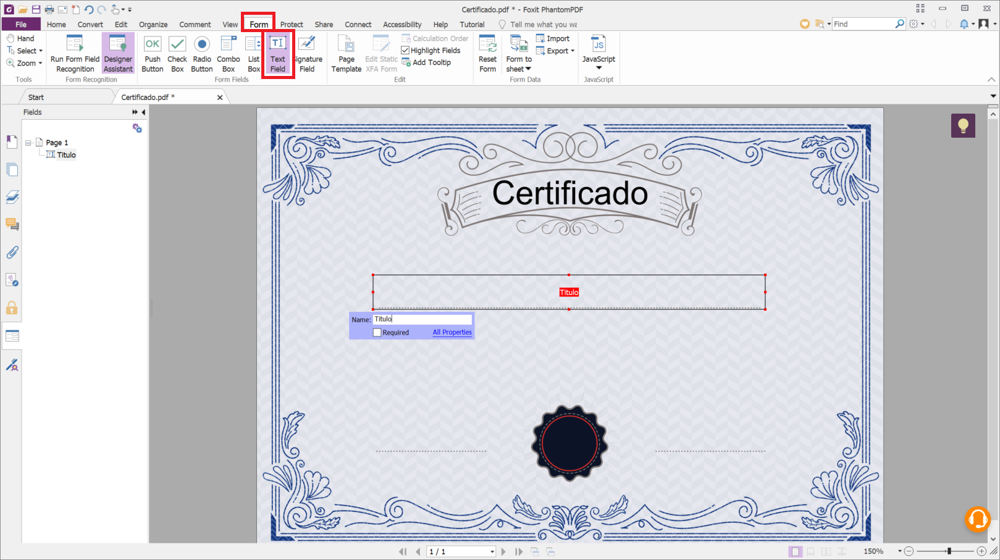
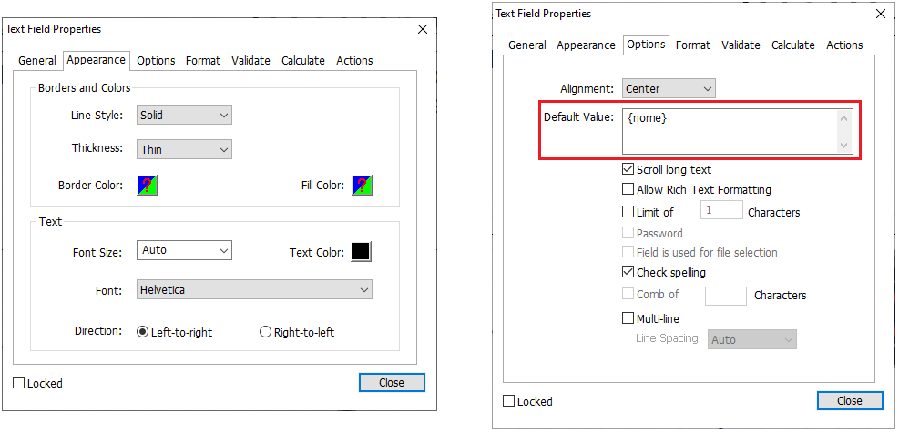
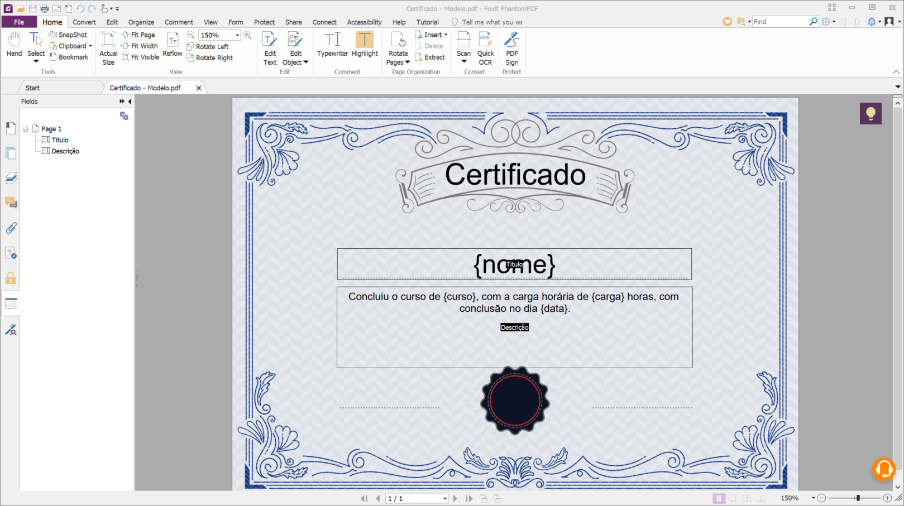
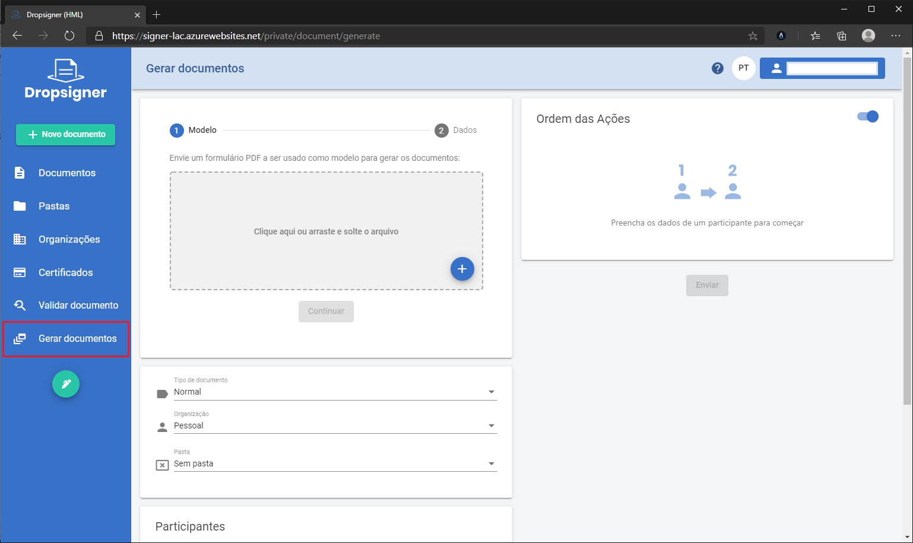
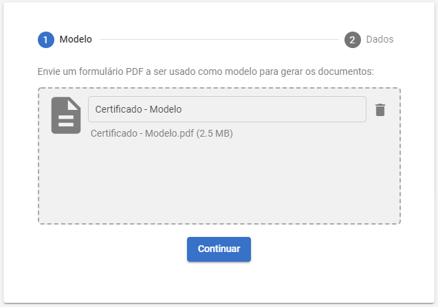
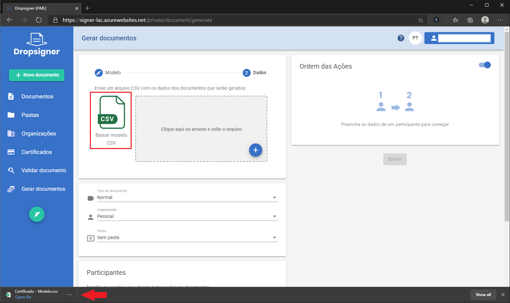
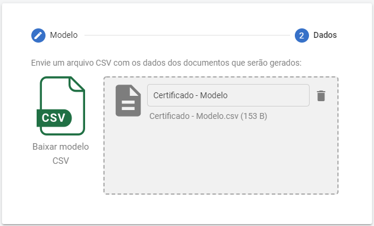
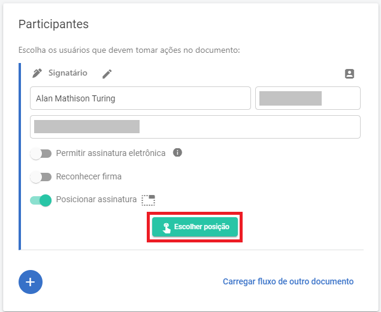
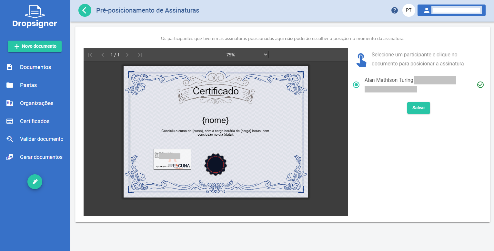
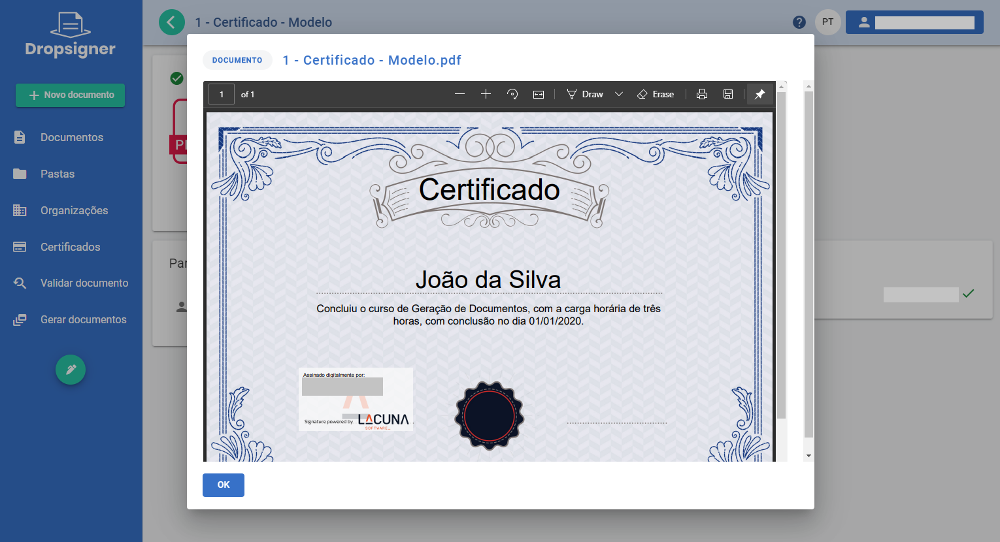

# Lacuna Signer - Geração de documentos

Para gerar documentos PDF a partir de um modelo no [Signer](../index.md), siga os passos abaixo.

## Criando o modelo PDF

Antes de gerar documentos no Signer, é necessário ter um modelo PDF. Um modelo consiste em um documento PDF com campos de formulário editáveis e preenchidos com texto, incluindo marcações dos locais onde o texto específico de cada documento gerado será inserido. Nesse exemplo, será usado o software [PhantomPDF](https://www.foxitsoftware.com/pdf-editor/) para criação do formulário PDF, mas o usuário é livre para escolher qualquer software de sua preferência com essa funcionalidade.

### Adicionando campos de formulário ao PDF
Abra um PDF existente no PhantomPDF, navegue para a seção de *formulário* e selecione a opção de *campo de texto*

Com um clique duplo no campo de formulário é possível escolher opções de aparência e formatação, como tamanho e estilo de fonte. Também é possível preencher o campo com um texto padrão. Nesse campo, digite o texto que deve aparecer nos documentos gerados, usando '{' e '}' para indicar a parte do texto que deve ser substituída pelos dados fornecidos na geração de documentos.

Repita isso para todos os campos que quiser criar e salve o arquivo.

## Gerando documentos no Signer

Na barra lateral do Signer, selecione a opção **Gerar documentos**.

Envie o modelo PDF criado anteriormente e clique em **Continuar**.

Clique em **Baixar modelo CSV** e abra o arquivo baixado no Excel ou em um editor de texto puro.

Cada linha do arquivo CSV representa um documento que será gerado. A coluna **\[filename\]** determina o nome do documento gerado. Caso ela seja deixada em branco, o nome do documento será gerado automaticamente. Cada uma das demais colunas foi gerada automaticamente a partir dos identificadores que aparecem entre chaves nos campos de formulário do modelo enviado. O valor dessas colunas substituirá o identificador correspondente no modelo enviado.

Preencha o arquivo CSV e salve suas alterações.

Envie o arquivo CSV preenchido.

Preencha as demais configurações da mesma maneira que no envio de documentos. É possível determinar a posição da assinatura de cada signatário no modelo.

>[!TIP]
>É recomendado que as assinaturas sejam posicionadas no momento da geração dos documentos. Caso isso não seja feito, as assinaturas de cada um dos documentos gerados podem ficar em posições diferentes.

Após preencher as opções e o fluxo dos documentos da maneira desejada, clique em **Enviar**. Os documentos serão gerados e os participantes serão notificados.

Após as assinaturas, os documentos gerados e assinados estarão disponíveis para download.

## Veja também

* [Guia do usuário](index.md)
